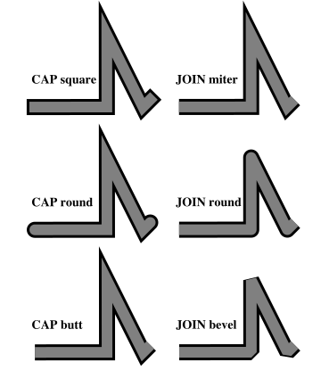
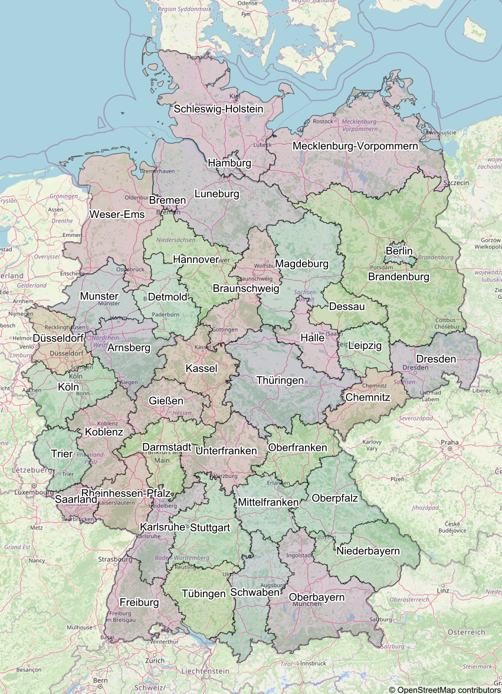

# Mapy Project

## Overview
Mapy is a Python library designed easily render static maps in python. It is designed to be simple to use and easy to integrate with existing codebases. The library supports rendering background, tiled raster, filled polygon, and other layers on the map. It directly supports geometric primitives, allowing users to directly render shapely geometries. 

Input data must be in the `EPSG:4326` - WGS84 projection.

### Supported Layer Types

| type | status | description | data source|
| ---- | ------ | ----------- | -------- |
| `BackgroundLayer` | ✅ | renders a simple background with a single color | Color | 
| `TiledRasterLayer` | ✅ | renders a tiled raster layer can can load xyz tiles | xyz via http(s) |
| `FillLayer` | ✅ | renders a fill layer for polygons| Polygon and MultiPolygon |
| `LineLayer` | ✅ | renders a line layer that draw LineStrings | LineString and MultiLineString|
| `CircleLayer` | ✅ | renders a circle layer for Points | Point and MultiPoint |
| `SymbolLayer` | ✅ | renders a symbol and/or text for points| Point and MultiPoint |
| `Attribution` | ✅ | an attribution | str and list[str] |


## Installation
To install the Mapy library, clone the repository and install the required dependencies:

```bash
git clone <repository-url>
cd mapy
poetry install
# or
pip install .
```

This library uses Cairo. You have to install cairo with your package manger of choice.

on mac

```bash
brew install cairo
```

## Usage

The Mapy library is designed to be simple to use. The following sections provide examples of how to create a map with different layers. Note that in almost all cases you would have to add an attribution layer to the map. For example, if you use OpenStreetMap tiles, you would have to add the OpenStreetMap attribution to the map. This is not done automatically!


### Creating a simple Map

Here is an example of how to create a simple map with a filled polygon:

```python
import mapy
my_map = mapy.Map()
tile_layer = mapy.TiledRasterLayer(
    [
        "https://tile.openstreetmap.org/{z}/{x}/{y}.png",
    ]
)
my_map.add_layer(tile_layer)
my_map.add_layer(Attribution("© OpenStreetMap contributors"))

surf = my_map.render(
    mapy.FixedScreenSize(
        Box.from_lng_lat(5.988, 47.302, 15.016, 54.983), mapy.ScreenSize(512, 512)
    )
)
surf.write_to_png("my_map.png")

```

If you want to use the map on a public place be sure to include proper attribution. This code will generate a map with a filled polygon and save it as `simple_map.png`.


#### Background Layer
A background layer provides a solid color background for the map.

```python
background_layer = mapy.BackgroundLayer(mapy.Color(1, 1, 1))
my_map.add_layer(background_layer)
```

#### Tiled Raster Layer
A tiled raster layer allows the use of map tiles from sources like OpenStreetMap.

```python
tile_layer = mapy.TiledRasterLayer(
    [
        "https://tile.openstreetmap.org/{z}/{x}/{y}.png",
    ]
)
my_map.add_layer(tile_layer)
```

#### Fill Layer
A fill layer can be used to add filled polygons with customizable colors and borders.

```python
from shapely.geometry import shape

polygon = shape(json)
fill_layer = mapy.FillLayer(
    [
        mapy.FillItem(
            polygon,
            fill_color=mapy.Color(0.5, 0.5, 0.5, 0.3),
            line_color=mapy.Color(0, 0, 0),
            line_width=2,
        )
    ]
)
my_map.add_layer(fill_layer)
```

#### Line Layer
A line layer can be used to show LineStrings on the map

```python
from shapely.geometry import shape

line = shape(json)
fill_layer = mapy.LineLayer(
    [
        mapy.LineItem(
            line,
            join=mapy.LineJoin.round,
            cap=mapy.LineCap.round
            width=12,
            outline_width=3,
            outline_color=Colors.BLACK,
        )
    ]
)
my_map.add_layer(fill_layer)
```

The `LineItem` options `cap` and `join` lead to the following results:




#### Circle Layer
A circle layer can be used to show Points on the map

```python
from shapely.geometry import shape

point = shape(json)
circle_layer = mapy.CircleLayer(
    [
        mapy.CircleItem(
            point,
            fill_color=mapy.Color(0.5, 0.5, 0.5, 0.3),
            line_color=mapy.Color(0, 0, 0),
            line_width=2,
            radius=10,
        )
    ]
)
my_map.add_layer(circle_layer)
```

#### Symbol Layer
A symbol layer can be used to show Points on the map. You can load custom icons by using the `mapy.Icon.from_path` class method.

##### Limitations
- The text is not automatically placed relative to the symbol. You have to calculate the position yourself.
- No collision detection is implemented. If you place multiple symbols with text on top of each other, the text and symbols will overlap. This might get added in the future, but is somewhat complicated to implement.


```python
from shapely.geometry import shape

point = shape(json)
symbol_layer = mapy.SymbolLayer(
    [
        mapy.SymbolItem(
            point,
            icon=mapy.Icons.PIN_24,
            text="Hello World",
            text_offset=(0, 16)
        )
    ]
)
my_map.add_layer(symbol_layer)
```

You can set the anchor of the text with the `text_anchor` parameter. The default is `mapy.TextAnchor.BOTTOM_LEFT`. The following options are available:

|   |   |   |
| - | - | - |
|  |  |  |
|  |  |  |
|  |  |  |


#### Attribution
An attribution layer can be used to add attribution to the map. This is important if you use tiles from a public source like OpenStreetMap.

```python   
attribution = mapy.Attribution("© OpenStreetMap contributors")
my_map.add_layer(attribution)
```


## Testing

The project includes unit tests to ensure the functionality of various components. To run the tests, use the following command:

```bash
pytest
```

## Output Example

The image below is an example of a map created using the Mapy library:



## License
This project is licensed under the MIT License.

## Contributing
Contributions are welcome! Please submit a pull request or open an issue for any changes or suggestions.


